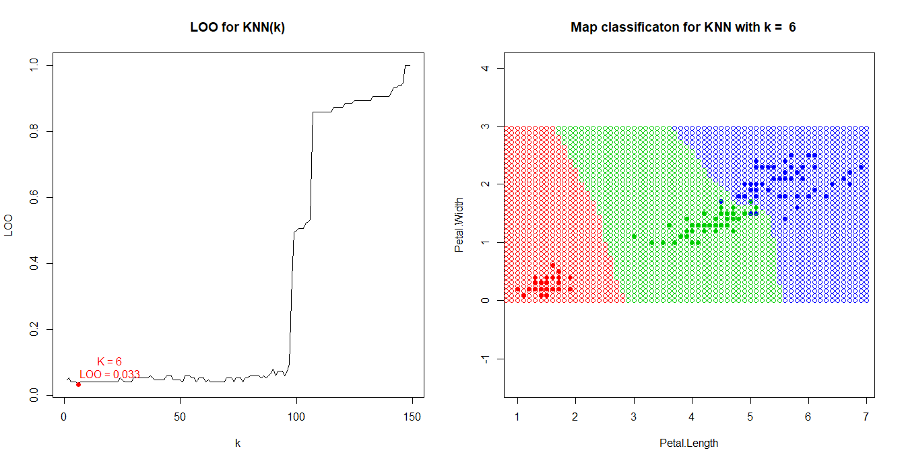
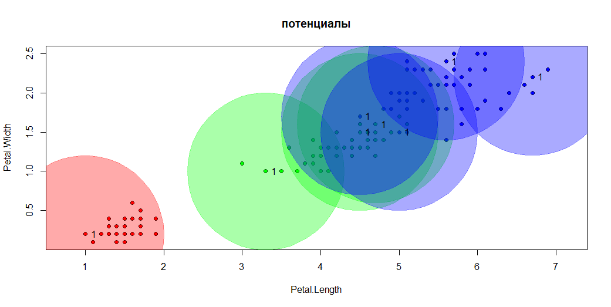
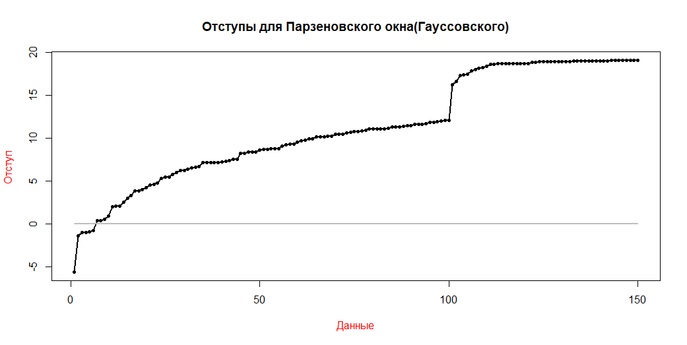
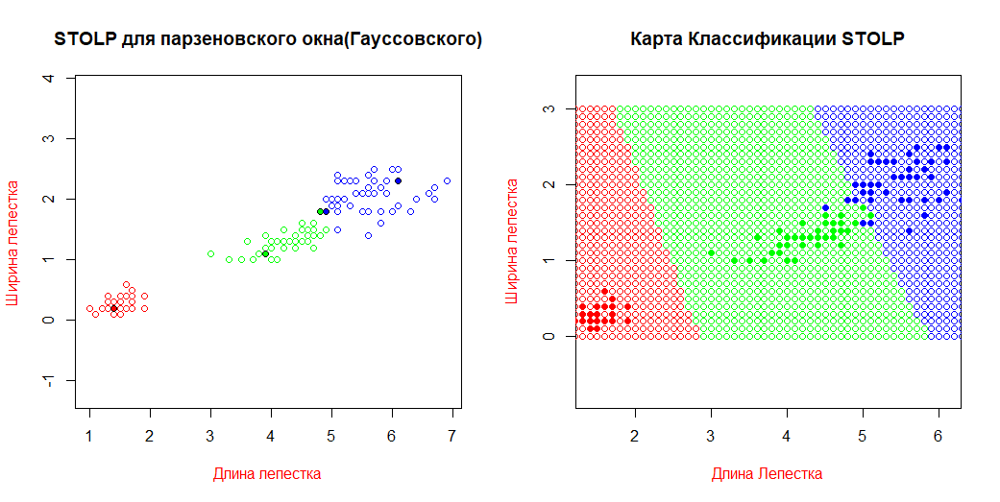
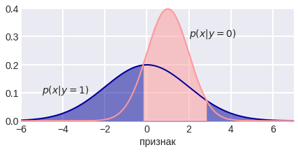
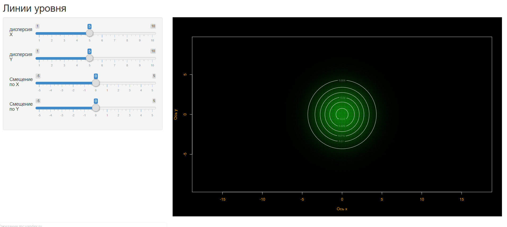
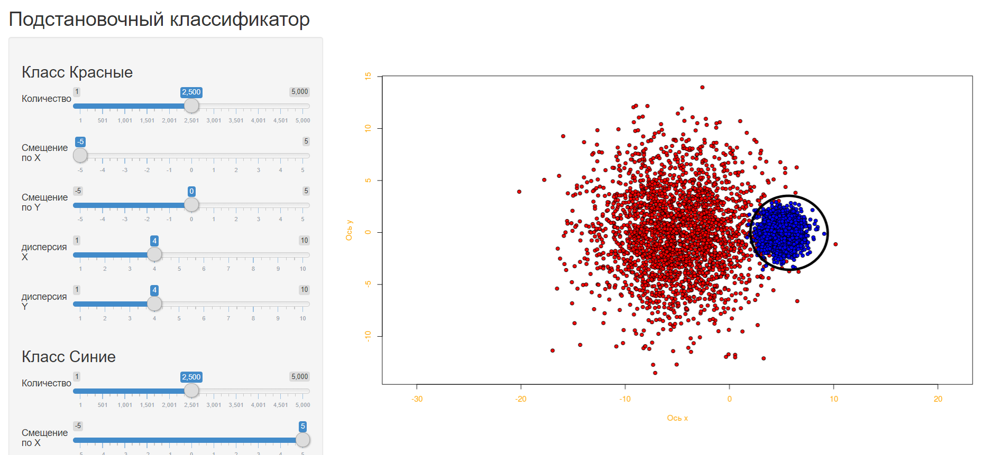

# MachineLearning

- [Метрические алгоритмы классификации](#Метрические-алгоритмы-классификации)
  - [1NN](#1NN)
  - [KNN](#KNN)
  - [KWNN](#KWNN)
  - [Сравнение качества алгоритмов kNN и kwNN](#Сравнение-качества-алгоритмо-kNN-и-kwNN)
  - [Парзеновское окно](#Парзеновское-окно)
  - [Метод Потенциальных Функций](#Метод-потенциальных-функций)
  - [Сравнение алгоритмов классификации](#Сравнение-алгоритмов-классификации)
  - [STOLP](#STOLP)
- [Байесовский классификатор](#Байесовский-классификатор)
  - [Линии уровня](#Линии-уровня)
  - [Подстановочный алгоритм](#Подстановочный-алгоритм)


## Метрические алгоритмы классификации
__Гипотеза компактности:__
Схожим объектам соответствуют схожие ответы.
Для формализации понятия сходства вводится __функция расстояния__ в
пространстве объектов X. 

__Метрические методы обучения__ — методы, основанные на анализе сходства
объектов. (similarity-based learning, distance-based learning).

## 1NN 
Алгоритм ближайшего соседа – 1NN относит классифицируемый объект
u ∈ X к тому классу, которому принадлежит его ближайший сосед:
<a href="http://www.picshare.ru/view/9312477/" target="_blank"></a>


__Преимуществ:__
<ul>
  <li>Простота реализации.</li>
</ul>

__Недостатки:__
<ul>
  <li>Неустойчивость к погрешностям — выбросам.</li>
  <li>Отсутствие параметров, которые можно было бы настраивать по выборке.</li>
  <li>Алгоритм полностью зависит от того, насколько удачно выбрана метрика ρ.</li>
  <li>Низкое качество классификации.</li>
</ul>

## KNN 

__Алгоритм k ближайших соседей – kNN__ относит объект u к тому классу,
элементов которого больше среди k ближайших соседей x.
__функция оценки близости__  <br><a href="https://imgbb.com/"></a>

При k = 1 получаем метод ближайшего соседа
и, соответственно, неустойчивость к шуму, при k = l, наоборот, алгоритм
чрезмерно устойчив и вырождается в константу. Таким образом, крайние значения
k нежелательны. На практике оптимальное k подбирается по критерию
скользящего контроля LOO.

 
## KWNN
Существует и альтернативный вариант метода kNN: в каждом классе выбирается
__k__ ближайших к __U__ объектов, и объект u относится к тому классу, для
которого среднее расстояние до __k__ ближайших соседей минимально.

где,
 — строго убывающая последовательность вещественных весов, задающая
вклад i-го соседа при классификации объекта u.

 
я решил использовать весы такого вида
```
weightsKWNN = function(i, k)
{
  (k + 1 - i) / k
}
```

## Сравнение качества алгоритмо kNN и kwNN. 

kNN — один из простейших алгоритмов классификации, поэтому на реальных задачах он зачастую оказывается неэффективным. Помимо точности классификации, проблемой этого классификатора является скорость классификации.

kwNN отличается от kNN, тем что учитывает порядок соседей классифицируемого объекта, улчшая качество классификации.
Пример, показывающий преимущество метода kwNN над kNN:
<a href="http://www.picshare.ru/view/9312480/" target="_blank"></a>

В примере передается параметр k=5. Так как Kwnn в отличии от Knn оценивает не только индекс соседа, но и его расстояние, то результат получается более точный, в этом примере это наглядно видно.

## Парзеновское окно
В методе Парзеновского окна, мы используем ту же Евклидову метрику, и используем весовую функцию w(i,u) как функцию не от ранга соседа, а  функцию от расстояния, однако в отличии от  KWNN, вместо k объектов, используется ширина окна, которую я нахожу с помощью метода Скользящего Контроля LOO, а функция веса реализована с помощью различных ядер.
Программная реализация :
```
Parzen = function(XL,y,h,metricFunction = euclideanDistance)
{
  n = dim(XL)[1]
  weights = rep(0,3)
  for(i in 1:n)
  {   
    x=XL[i,1:2]
    class=XL[i,3]
    r = metricFunction(x,y)/h
    weights[class]=kernelG(r)+weights[class];
  }
  
  class = names(which.max(weights))
  if(max(weights)==0){
    return ("NA")
  }
  else{
    return (class)
  }
}
```

Я программно использовал такие ядра:

Епанечниково 
```
kernelEP = function(r){
  return ((3/4*(1-r^2)*(abs(r)<=1)))
}
```
.png) 


Прямоугольное 
```
kernelR = function(r){
  return ((0.5 * (abs(r) <= 1) ))
} 
```
.png) 

Треугольное 
```
kernelT = function(r){
  return ((1 - abs(r)) * (abs(r) <= 1)) 
}
```
.png) 
Квартическое 
```
kernelQ = function(r){
  return ((15 / 16) * (1 - r ^ 2) ^ 2 * (abs(r) <= 1)) 
}
```
.png) 
Гауссовское 
```
kernelG = function(r){
  return (((2*pi)^(-1/2)) * exp(-1/2*r^2))
}
```
.png) 

__Вывод:__

Разница в качестве классификации очень слабая,  только гауссовское ядро заметно отличается. 
Т.К алгоритм для классифицируемой точки u строит окружность, радиусом h. Все точки, не попавшие в эту окружность, отсеиваются (в ядрах кроме гауссовского). Для всех остальных ядер, находится вес, для каждой точки внутри окна, суммируется, и класс с наибольшим весом, присваивается обучаемому объекту.

## Метод потенциальных функций
Метод потенциальных функций - метрический классификатор, частный случай метода ближайших соседей. Позволяет с помощью простого алгоритма оценивать вес («важность») объектов обучающей выборки при решении задачи классификации.

Для оценки близости объекта классифицируемого объекта u к классу y, алгоритм использует следующую функцию: 


Я использовал Епанечниково ядро для оценки веса. В моей реализации алгоритм подбирает только силу потенциала , радиус потенциалов h я задал заранее фиксированным.

Программная реализация подбора потенциалов пока точность алгоритма, не будет меньше заданной ошибки myError
```
potentials = function(XL,class,n,h,myError){
  error=100
  pots = rep(0,n)  
  while(error>myError)
  {    
    while(TRUE){
      z=sample(1:n,1)
      x=XL[z,1:2]
      point = PF(pots,XL,x,h)
   
      if (colors[point] != colors[class[z]]) {
        pots[z] = pots[z] + 1
        break
      } 
    }
     
      error = 0
      for (i in 1:n) {
        x = XL[i,1:2]
        points=XL[,1:3]
        if (colors[PF(pots,points,x, h)]!= colors[class[i]]){
          error = error + 1
        }
      }
      print(error)
  }
  return(pots)
}
```
Алгоритм для каждого обучающего объекта x  имеющего потенциал строит окружность, радиуса h.
 

## Сравнение-алгоритмов-классификации
<table>
<tr><td>Метод</td><td>параметры</td><td>величина ошибок</td><tr>
<tr><td> 1NN</td><td>-</td><td>0.47</td><tr>
<tr><td> KNN</td><td>k=6</td><td>0.33</td><tr>
<tr><td> KWNN</td><td>k=9</td><td>0.33</td><tr>
<tr><td> Парзеновское окно</td><td>h=0.4;h=0.1(Гауссовское)</td><td>0.4</td><tr>
</table>


## STOLP
__Алгоритм СТОЛП (STOLP)__ — алгоритм отбора эталонных объектов для метрического классификатора.
Пусть у нас задана обучающая выборка, и некоторая метрика, такая, что выполняется гипотеза компактности. Если классифицировать объекты метрическим классификатором (я выбрал парзеновское окно), то время затрачиваемое на это для каждого объекта, пропорционально размеру обучающей выборке.

Так как не все объекты в выборке равноцеены, то мы можем разделить их на:
<ul>
<li><i>Эталонные</i> — типичные представители классов. Если классифицируемый объект близок к эталону, то, скорее всего, он принадлежит тому же классу.
<li><i>Неинформативные</i> — плотно окружены другими объектами того же класса. Если их удалить из выборки, это практически не отразится на качестве классификации.
<li><i>Выбросы</i> — находятся в окружении объектов чужого класса. Как правило,
их удаление только улучшает качество классификации.
</ul>

__Cуть алгоритма в том:__ Чтобы удалить из выборки все выбросы, и выбрать из каждого класса по этланному объекту(с самым большим отступом) затем, пока на количество ошибок на всей выборке не будет удовлетворять условию, добавлять к эталоном объект с наименьшим отступом.


Поэтому мы можем уменьшить объем обучающей выборки, оставив в ней только эталонные объекты для каждого класса, те самым улучшили эффективность работы алгоритма и уменьшили затрачеваемые им ресурсы.

Отступы для Парзеновского окна выглядят так:



где, для нахождения отступа наших объектов, я реализовал такую функцию
```
margin = function(points,classes,point,class){

  Myclass = points[which(classes==class), ]
  OtherClass = points[which(classes!=class), ]
  
  MyMargin = Parzen(Myclass,point[1:2],1,FALSE)
  OtherMargin = Parzen(OtherClass,point[1:2],1,FALSE)
  
  return(MyMargin-OtherMargin)
}

```

Используя метод STOLP, я сокращал количество ошибок до 3, алгоритм справился с поставленной задачей, за 2 прохода.

__В итоге__ осталось 5 эталонных объектов, скорость работы метода после алгоритма заметно улучшилась, а точность ухудшилась незначительно.
Точность алгоритма До отбора эталонных составляла:  0.96 (6 ошибок), а после: 0.94 (8 ошибок)




## Баейсовский классификатор
Мы решаем задачу __классификации__, нам нужно по известному вектору признаков __x__, определить класс  к которому принадлежит объект __a(x)__  по правилу : __a(x) = argmax P(y|x)__, для которого максимальна вероятность класса y при условии x. 

Это тоже самое что __a(x) = argmax P(x|y)P(y)__, где __P(y)__ - априорная вероятность класса. 

## Байесовский классификатор
Мы решаем задачу __классификации__, нам нужно по известному вектору признаков __x__, определить класс  к которому принадлежит объект __a(x)__  по правилу : __a(x) = argmax P(y|x)__, для которого максимальна вероятность класса y при условии x. Это тоже самое что __a(x) = argmax P(x|y)P(y)__, где __P(y)__ - априорная вероятность класса. 



Если __P(y__) одинаковы для всех классов - мы просто выбираем класс, плотность которого больше в точке __x__.

## Линии уровня
Рассмотрим многомерное нормальное распределение. Пусть 
Вероятностное распределение с плотностью


называется n-мерным многомерным нормальным (гауссовским) распределением с математическим ожиданием (центром) 
n и ковариационной матрицей , которая является симметричной, невырожденной и положительно определенная.

Реализация программы в shiny: <a href="https://dracos150.shinyapps.io/shinytest/">нажми меня</a>

__Пример:__
Случай в котором признаки имеют одинаковые дисперсии, то линии уровня имеют форму элипсоидов, которые являются сферами с центром в точке  и параллельны осям координат.



## Подстановочный алгоритм

__Plug-in__ байесовский алгоритм классификации, в котором в качестве моделей восстанавливаемых плотностей рассматривают многомерные нормальные плотности.

Восстанавливая параметры  для каждого класса и подставляя в оптимальный байесовский классификатор получаем plug-in.

Чтобы узнать плотности распределения классов, алогритм восстанавливает неизвестные параметры  по следующим формулам для каждого класса :


Выбирая различные матрицы ковариации и центры для
генерации тестовых данных, будем получать различные виды
дискриминантной функции.


Реализация программы в shiny: <a href="https://dracos150.shinyapps.io/PlugIn/">нажми меня</a>

__Пример:__
Случай в котором признаки имеют одинаковые дисперсии,  элипсоиды являются сферами.



